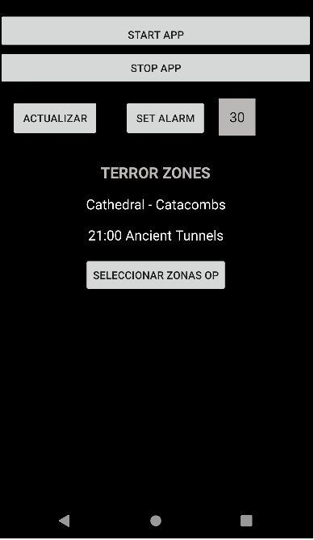
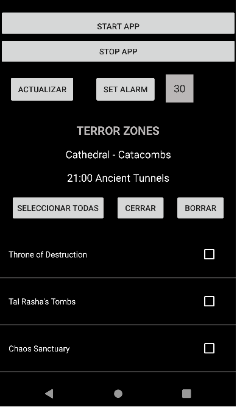
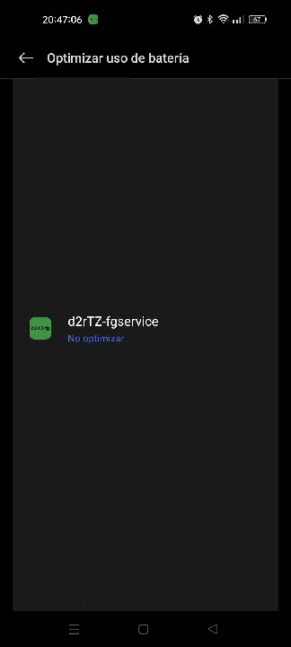
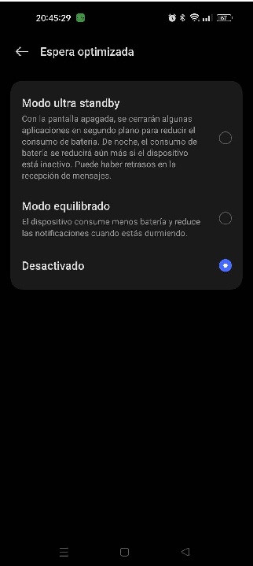
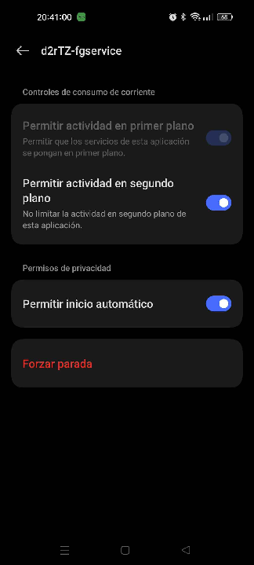

## What is it?
Android's app that checks the next terror zone for Diablo 2 Resurrected.
- Checks API https://www.d2emu.com/api/v1/tz to see current, next and next_hour of terror zone.
- It shows the info and creates a foreground service and a notification with alarm:
  - At customizable minute, it will check every hour if selected terror zone is next and will make a notification with alarm sound (lasts 15 minutes in the notification bar). 
  - You can select inside app the terror zones to be alarmed with. If you check some of them and next terror zone matches with one of your selected zones, you will receive a notification with alarm sound.
- **Since d2emu API now requires authorization in headers, you must put your username and token inside Utils.kt** before building apk.
- Tested in Android 7, 10, 11, 12, 13 with Xiaomi and Realme phones.
- Based on the work from [Roberto Huertas](https://github.com/robertohuertasm), you can check a detailed info [here](https://robertohuertas.com/2019/06/29/android_foreground_services/) and [his repo](https://github.com/robertohuertasm/endless-service).
## How does it work?
- You need to press START APP button for creating the foregorund service. You will receive a notification.
- You can set the minute for the alarm (it is 30 minute by default), then press SET ALARM button and alarm will be programmed.
- If you want to change the minute of the alarm, just put the new minute and press SET ALARM and the new alarm will be programmed
- Press the SELECCIONAR ZONAS OP button to see the list of terror zones, then you can select what you want and then press CERRAR button.
- To stop the app, just press STOP APP button and you can remove the foreground service notification for notification bar.
## Images from app
 
## **WARNING**:
- You need to allow notifications, background data and no battery restrictions/optimizations in your phone.
- If you have a Realme phone you need to:
  - Bateria / Optimizar uso de bateria / no optimizar
  - Bateria / Espera optimizada / desactivado
  - App / Uso de bateria / permitir en segundo plano / permitir inicio automatico
- For example, here you can see pictures from settings from Realme Android 13:
  