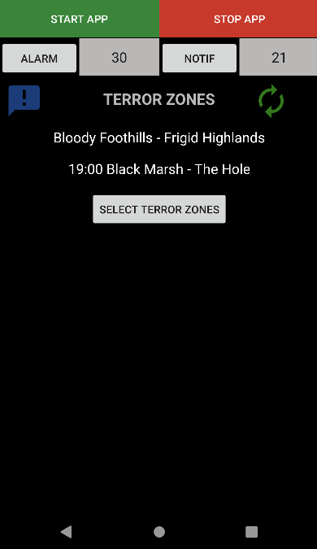
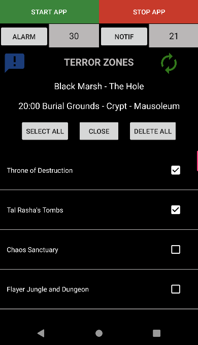
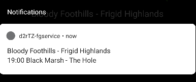
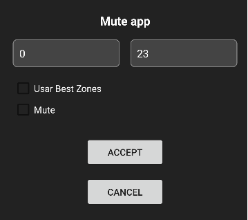
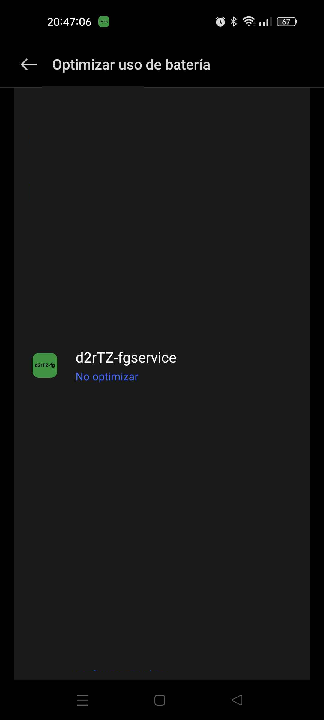
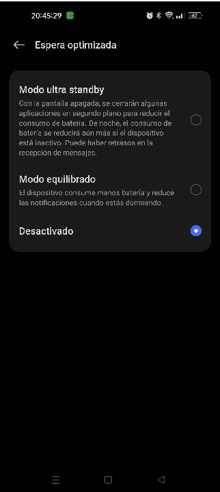
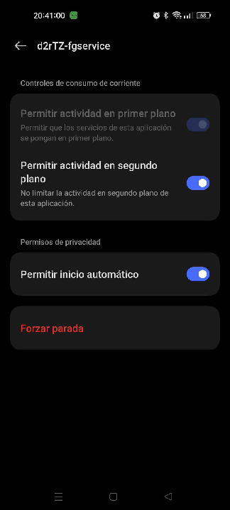

# v1.35
- **Fixed:** since v1.30, a possible empty fg notification and app hang occurring when the phone is charging on Android 13.
- Update foregroundServiceType to use dataSync instead of specialUse.

# v1.31
- Fix an issue where app notifications hang when Cloudflare is blocked by Spanish mobile network operators.

# v1.30
- **New feature**: new button to mute the app within a specific time range.
- You can edit the start hour and end hour in the mute dialog. With 'Mute' on, the app will remain active but alarms will be muted during your chosen time period.
- If you tick 'Mute' and also 'Use Best Zones' (by default: throne, tal rasha, chaos), the app will remain muted, triggering alarms only for those Best Zones.

# v1.20
- **New feature**: now logs current zone in a sqlite database with their timestamp when `alarm` minute has passed.
- By default, it will auto delete data with *x=3* days old. A code snippet is provided inside EndlessService-checkApi() to give the ability to auto delete the DB with *x* days old.
- Added a button (`H`) to show zone history for the last *x=2* days.
- You can configure some variables inside Utils.kt file.

# v1.10

## What is it?
Android's app that checks the next terror zone for Diablo 2 Resurrected.
- Checks API https://www.d2emu.com/api/v1/tz to see current, next and next_hour of terror zone.
- It shows the info and creates a foreground service and a notification with alarm:
  - At customizable minute, it will check every hour if selected terror zone is next and will make a notification with alarm sound (lasts 15 minutes in the notification bar). 
  - You can select inside app the terror zones to be alarmed with. If you check some of them and next terror zone matches with one of your selected zones, you will receive a notification with alarm sound.
  - You can select custom minute to update the foreground notification.
  - The foreground notification will auto update itself with current info from d2emu API based on delay time and custom minute.
- **Since d2emu API now requires authorization in headers, you must put your `username` and `token` inside Utils.kt** before building apk.
- **UPDATE: now API responds with "delay" and "next_available_time_utc**. Delay is the time from next_terror_time_utc that next zone will be available at API.
- Reworked layout to include new buttons: update view (green arrows) and info (blue exclamation mark).
- Tested in Android 7, 10, 11, 12, 13 with Xiaomi and Realme phones.
- Based on the work from [Roberto Huertas](https://github.com/robertohuertasm), you can check a detailed info [here](https://robertohuertas.com/2019/06/29/android_foreground_services/) and [his repo](https://github.com/robertohuertasm/endless-service).

## How does it work?
- You need to press START button for creating the foreground service. You will receive a notification.
- Notificaction will update itself at xx.01 with new info from API and auto update based on delay received and/or custom minute.
- You can set the minute for the alarm (it is 40 minute by default), then press ALARM button and alarm will be programmed.
- If you want to change the minute of the alarm, just put the new minute and press ALARM and the new alarm will be programmed.
- You can set the minute for the auto update notification (it is 11 minute by default), then press NOTIF button and notification update will be programmed.
- Press the SELECT TERROR ZONES button to see the list of terror zones, then you can select what you want and then press CLOSE button.
- To stop the app, just press STOP button and you can remove manually the foreground service notification for notification bar.
- You can customize settings in file `Utils.kt`.

# Images from app
   

# **WARNING**:
- You need to allow notifications, auto launch, background data and no battery restrictions/optimizations in your phone.
- If you have a Realme phone you need to:
  - Bateria / Optimizar uso de bateria / no optimizar
  - Bateria / Espera optimizada / desactivado
  - App / Uso de bateria / permitir en segundo plano / permitir inicio automatico
- For example, here you can see pictures from settings from Realme Android 13:
  

---
---
---

# v1
## What is it?
Android's app that checks the next terror zone for Diablo 2 Resurrected.
- Checks API https://www.d2emu.com/api/v1/tz to see current, next and next_hour of terror zone.
- It shows the info and creates a foreground service and a notification with alarm:
  - At customizable minute, it will check every hour if selected terror zone is next and will make a notification with alarm sound (lasts 15 minutes in the notification bar). 
  - You can select inside app the terror zones to be alarmed with. If you check some of them and next terror zone matches with one of your selected zones, you will receive a notification with alarm sound.
- **Since d2emu API now requires authorization in headers, you must put your username and token inside Utils.kt** before building apk.
- Tested in Android 7, 10, 11, 12, 13 with Xiaomi and Realme phones.
- Based on the work from [Roberto Huertas](https://github.com/robertohuertasm), you can check a detailed info [here](https://robertohuertas.com/2019/06/29/android_foreground_services/) and [his repo](https://github.com/robertohuertasm/endless-service).
## How does it work?
- You need to press START APP button for creating the foreground service. You will receive a notification.
- Notificaction will update itself at xx.01 with new info from API.
- You can set the minute for the alarm (it is 40 minute by default), then press SET ALARM button and alarm will be programmed.
- If you want to change the minute of the alarm, just put the new minute and press SET ALARM and the new alarm will be programmed.
- Press the SELECCIONAR ZONAS OP button to see the list of terror zones, then you can select what you want and then press CERRAR button.
- To stop the app, just press STOP APP button and you can remove the foreground service notification for notification bar.